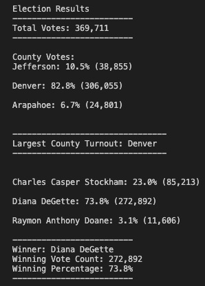

# Election_Analysis
The purpose of this project is to calculate the election audit results for an US Congressional precint using Python script

## Overview of Election Audit
The Colorado board of employee ( Tom) wants to calculate the election results,Usually this is performed by excel but Tom's manager want him to automate the process using python script so that the script could be reused for different elections.There are three primary voting methods taken in to account such as Mail in ballots(hand counted),punch cards(machine counted),and direct recording electronic DRE counting(computer counted).The vote cast by these methods determine the final election results.After the votes are counted,the file is gathered in a csv file.The file consists of three columns **Ballot ID,County,Candidate Name.**
The tasks included to perform for this analysis are:
  1. Calculate the total number of votes casted.
  2. Display the complete list of candidates who received votes.
  3. Calculate the total number of votes of each canditate received and their vote percentage.
  4. Calculate the winner based on the vote count and percentage received.
  5. Calculate the voter turn out for each county and percentage of votes received from each county.
  6. Calculate and announce the largest county turnout.

### Resources

**DataSource**: [election_results.csv](https://github.com/fathi129/Election_Analysis/blob/master/Resources/election_results.csv)

**Softwares used**: Python 3.9.7, Visual Studio code 1.66.2

**Election Report**: [election_analysis.txt](https://github.com/fathi129/Election_Analysis/blob/master/Analysis/election_analysis.txt)

## Election-Audit Results:
The analysis of the election shows that
- **Total Votes Cast** in this congressional election was **369,711**.
### County Votes:
- **Jefferson** county has received `10.5%` vote percentage with a total votes of **38,855**
- **Denver county** has received `82.8%` vote percentage with a total votes of **306,055**
- **Arapahoe** county has received `6.7%` vote percentage with a total votes of **24,801**
### County with Largest Number of Voter turnout:
- **Denver** county has the largest number of votes,total of **306,055**
- In addition, **Denver** county has the total votes percentage of `82.8%`
**Denver** county has the **Largest County Turnout**.
### Candidate Votes:
- **Charles Casper Stockham** has received`23.0%` of vote percentage with a total votes of **85,213**
- **Diana DeGette candidate** has received `73.8` of vote percentage with a total votes of **272,892**
- **Raymon Anthony Doane**  has received `3.1%`of vote percentage with a total votes of **11,606**
### Winning Summary:
- **Diana DeGette** won the election, with a total votes of **272,892** and she has the total percentage votes of `73.8%`.
- **Diana DeGette** is the winner of the election.
  
|    Text File                                   |   Command Prompt 
|  -------------                                 |    ------------- 
|     |  

## Overview of Code:
In order to open and read the csv file we need to import the corresponding dependencies.The file path is specified using `join()` method so that based upon the operating system,the direct path is set.The file is opened using `with open()` method and read using `csv.reader()` method.The rows of the csv file are read,the header is identified.We have created the candidate name list inorder to store the list of candidate names and county name list to store the counties.The dictionaries were used in order to keep track of candidate and their votes.

## Candidate results:
Using the counter the total number of votes are calculated.In order to display the list of candidates,the  candidate name is checked through entire rows and the unique names are added in the list and their corresponding votes are counted and their percentage are calculated.

## County results
The same logic which is used for finding candidate list is used for finding county names and votes and their percentage is calculated.

The final results are formated using f string method and printed in command prompt and written in a text file.   
   
  
## Election-Audit Summary: 
- The automation script developed is very efficient and it gives quick results.It can be reused for several similar projects.It can be used for calculating results for any sort of elections like senatorial districts,Local electons,Federal election as it is designed to pull the candidates from the dataset.
- In addition to that we can change the county to state for calculating the Federal election.
- Expanding the election audit by including the county voter turn out is an example how the script can be reused.
- we can even calculate how many votes each candidate received in each county by adding conditions to the script.
- The code is flexible,we can modify the code based on our needs,we need to just give the dataset and run the script for the result.

